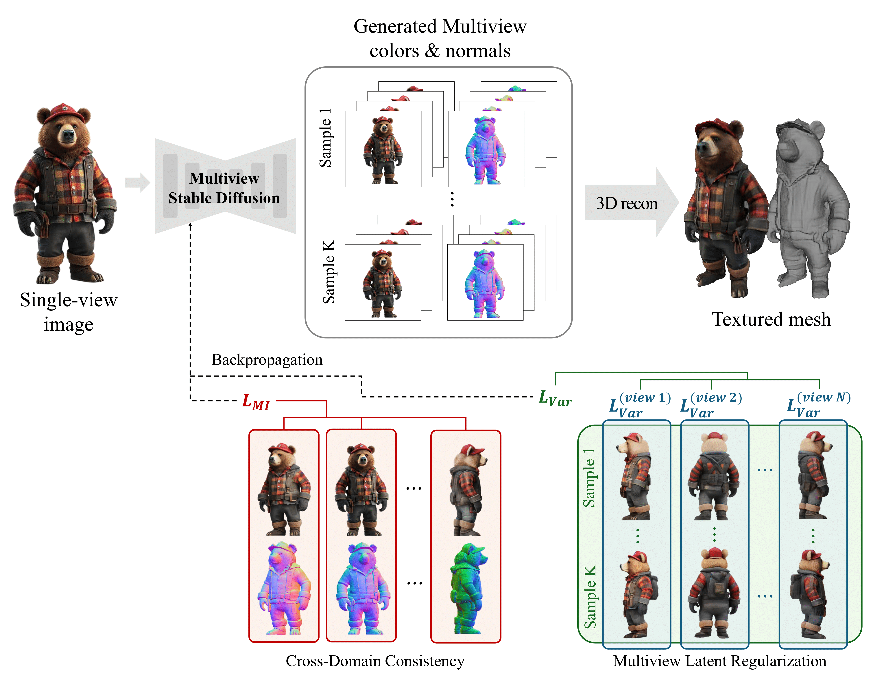

# Unicross3D : Unified Cross-View and Cross-Domain Diffusion for Consistent Single-Image 3D Generation
This is an official implementation of "Unified Cross-View and Cross-Domain Diffusion for Consistent Single-Image 3D Generation".

UniCross3D generates **multi-view RGB images and normal maps** from a single input image and reconstructs a **textured 3D mesh**, while explicitly enforcing:
- **Cross-view geometric consistency** (stable geometry across views)
- **Cross-domain alignment** between **color ↔ normal** (appearance consistent with geometry)
 
> The training and inference source codes will be released in the coming months.

## Method Overview

Given a single RGB input, UniCross3D synthesizes **N=6 novel-view pairs** of *(RGB, normal)* via a unified diffusion model, then reconstructs a textured mesh.
During training, we optimize the diffusion objective jointly with:

- **Cross-view latent regularization (L_var)**: penalizes variance of U-Net bottleneck features across multiple noise samples, reducing geometric/semantic drift across views.
- **Cross-domain mutual information (L_MI)**: maximizes mutual information between generated RGB and normals.
## Teaser

 UniCross3D produces:
- more consistent novel views (less "geometry drift / texture distortion"),
- better color–normal alignment (less “texture interpreted as geometry”),
- higher-fidelity reconstructed meshes, especially under challenging textures or non-canonical input viewpoints.

For additional qualitative and quantitative results, please refer to the paper.
